# JusticeLink — User Guide

JusticeLink provides free legal aid services in the Philippines. This guide covers how to use the platform for each type of account: **Citizens**, **Volunteer Attorneys**, and **Administrators**.

---

## Table of Contents

1. [Getting Started](#getting-started)
   - [Landing Page](#landing-page)
   - [Creating an Account](#creating-an-account)
   - [Logging In](#logging-in)
   - [Recovering Your Password](#recovering-your-password)
2. [Citizen Portal](#citizen-portal)
   - [Dashboard](#citizen-dashboard)
   - [Get Legal Help (Triage)](#get-legal-help-triage)
   - [Rights Library](#rights-library)
   - [Document Generator](#document-generator)
   - [Messages](#citizen-messages)
   - [Notifications](#notifications)
   - [Your Profile](#citizen-profile)
3. [Attorney Portal](#attorney-portal)
   - [Dashboard](#attorney-dashboard)
   - [My Cases](#my-cases)
   - [Clients](#clients)
   - [Case History](#case-history)
   - [Pro-Bono Hub](#pro-bono-hub)
   - [Service Logs](#service-logs)
   - [Messages](#attorney-messages)
   - [Your Profile](#attorney-profile)
4. [Admin Portal](#admin-portal)
   - [Dashboard](#admin-dashboard)
   - [Account Management](#account-management)
   - [Attorney Verifications](#attorney-verifications)
   - [Audit Logs](#audit-logs)
   - [System Settings](#system-settings)

---

## Getting Started

### Landing Page

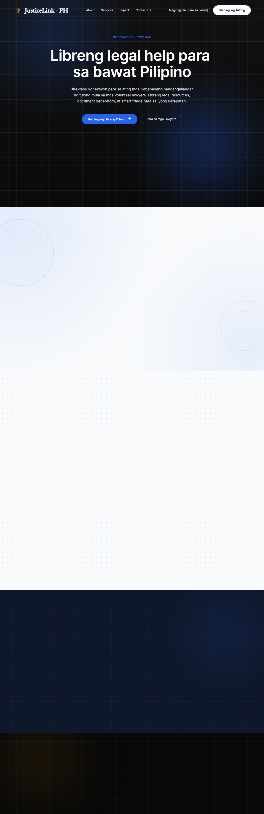

The JusticeLink homepage explains the platform's mission and features. Use the navigation to sign in or create a new account.

---

### Creating an Account

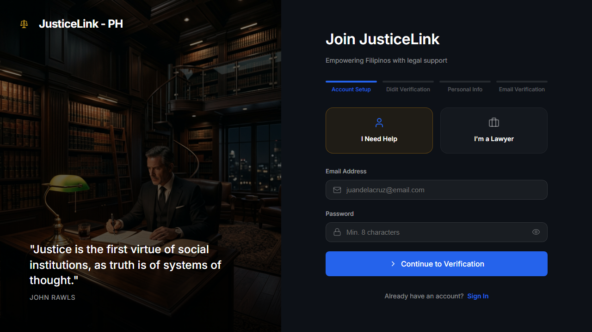

1. Click **Register** from the landing page or navigation bar.
2. Choose your account type:
   - **Citizen** — requires government ID verification through Didit.
   - **Volunteer Attorney** — requires IBP (Integrated Bar of the Philippines) credentials.
3. Fill in your personal details: full name, address, email, and password.
4. For **citizens**, you will be redirected to Didit's identity verification flow where you upload a government-issued ID and take a selfie.
5. For **attorneys**, upload a photo of your IBP card and a selfie. An admin will review and approve your account.
6. After verification, you will receive an email confirmation and can log in.

> **Philippine address selection** — The registration form includes dropdowns for Region, Province, City/Municipality, and Barangay. Select your address level by level from the top.

---

### Logging In

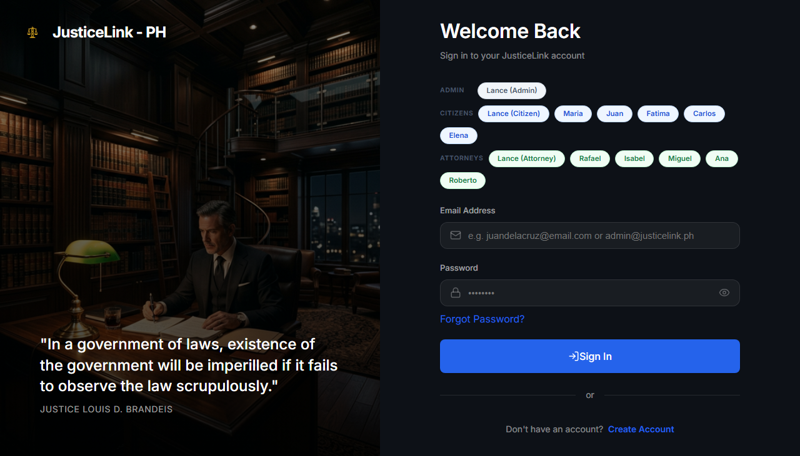

1. Go to `/login` or click **Sign In**.
2. Enter your registered email and password.
3. Click **Sign In**. You will be redirected to your role's portal dashboard.

---

### Recovering Your Password

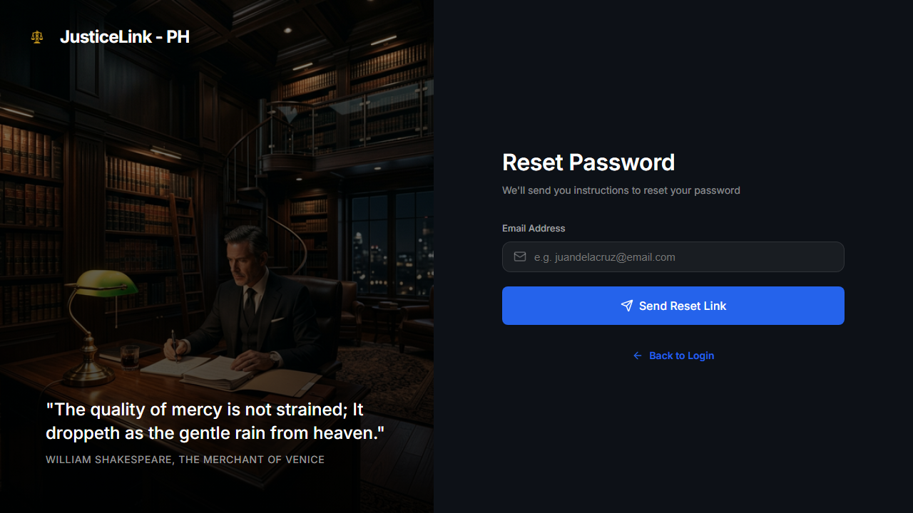

1. Click **Forgot password?** on the login page.
2. Enter the email address registered to your account.
3. Check your inbox for a password reset link and follow the instructions.

---

## Citizen Portal

The Citizen Portal is for residents seeking legal assistance. After logging in with a citizen account, you land at `/public/dashboard`.

---

### Citizen Dashboard

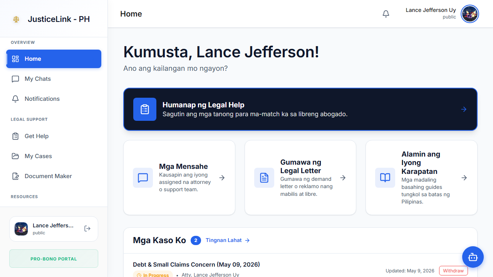

The dashboard shows:
- **Active case summary** — your current open cases and their statuses.
- **Recent notifications** — messages from your attorney or system updates.
- **Quick actions** — shortcuts to file a new case, generate a document, or view messages.

---

### Get Legal Help (Triage)

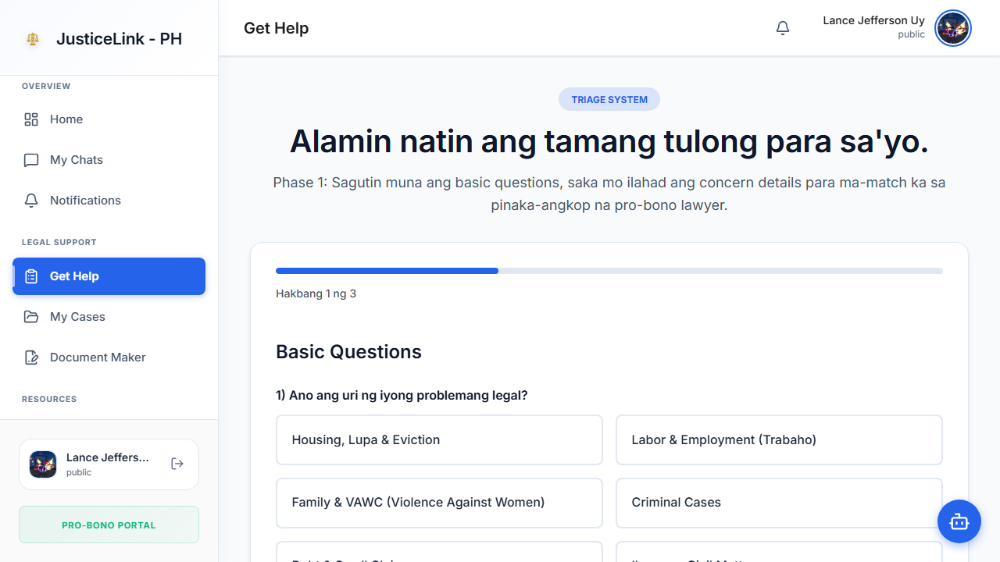

The triage wizard guides you through a series of questions to assess your legal situation:

1. Navigate to **Get Help** in the sidebar.
2. Answer the questions about your issue (housing, labor, family, consumer, cybercrime, etc.).
3. The system analyzes your responses and generates an assessment, including:
   - Identified legal issue category
   - Summary of your situation
   - Recommended next steps
   - Attorney match percentage
4. Submit to formally file your case. An attorney will be assigned based on the triage results.

> **Tip:** Be as specific as possible in your answers. The more detail you provide, the better the attorney match.

---

### Rights Library

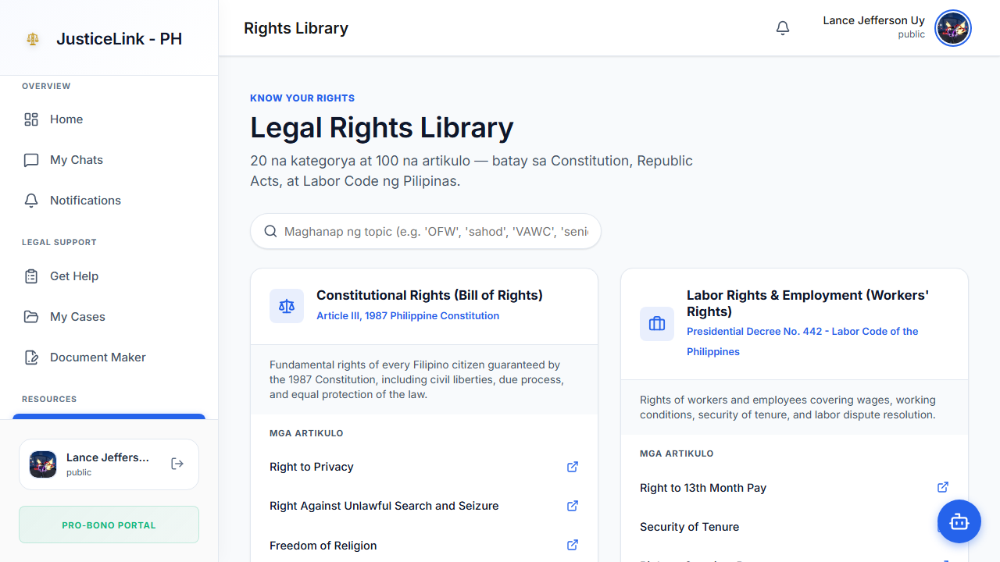

The Rights Library is a searchable collection of Philippine legal rights and resources:

- Browse by category: Labor, Family, Housing, Consumer, Civil Rights, etc.
- Search for specific topics using the search bar.
- Each article includes a plain-language explanation of the law, relevant legislation references, and practical guidance.

---

### Document Generator

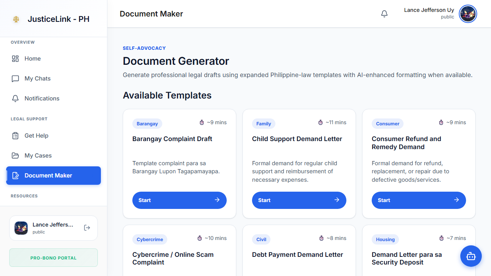

Generate ready-to-use legal documents from templates:

1. Navigate to **Document Maker** in the sidebar.
2. Browse the available templates:
   - Demand for Return of Security Deposit
   - Request for Property Repair
   - Wage Claim Letter
   - Notice of Illegal Dismissal
   - Child Support Demand Letter
   - VAWC Protection Order Request
   - Refund Demand Letter
   - Cybercrime Complaint Draft
   - Barangay Sumbong
   - And more...
3. Select a template and fill in the required fields (names, dates, amounts, etc.).
4. Click **Generate Document**. An AI-assisted draft is created within seconds.
5. Review, copy, or download the draft. You can edit it before submitting or printing.

> The generator uses AI (Groq) to produce natural-sounding documents. Always have a lawyer review important documents before serving them.

---

### Citizen Messages

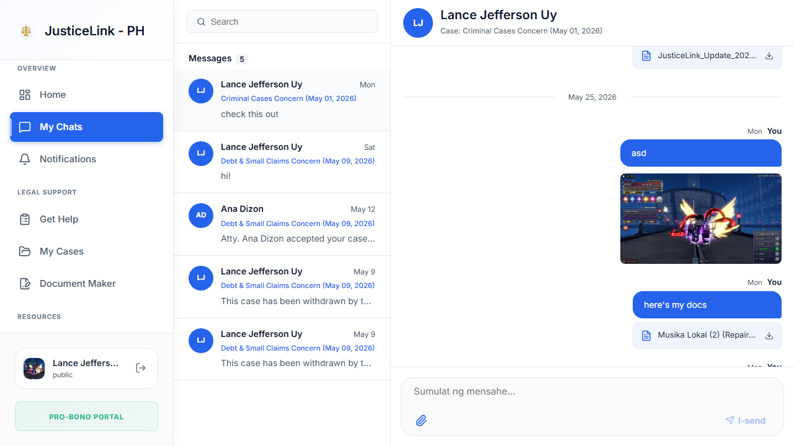

Communicate directly with your assigned attorney:

1. Navigate to **Messages** in the sidebar.
2. Select an existing conversation thread or start a new one linked to your case.
3. Type your message and press **Send**.
4. Attachments can be sent by uploading files within the chat.

Messages are private and only visible to you, your assigned attorney, and platform administrators.

---

### Notifications

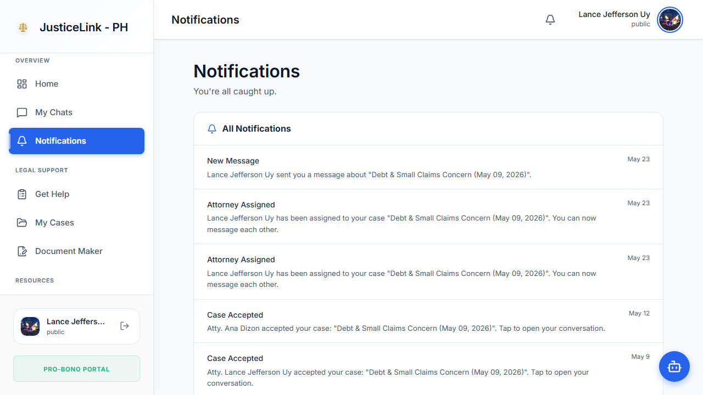

The Notifications page shows all platform alerts:
- New messages from your attorney
- Case status updates
- Document generation completions
- System announcements

Click a notification to navigate directly to the relevant page. Use **Mark all as read** to clear the badge count.

---

### Citizen Profile

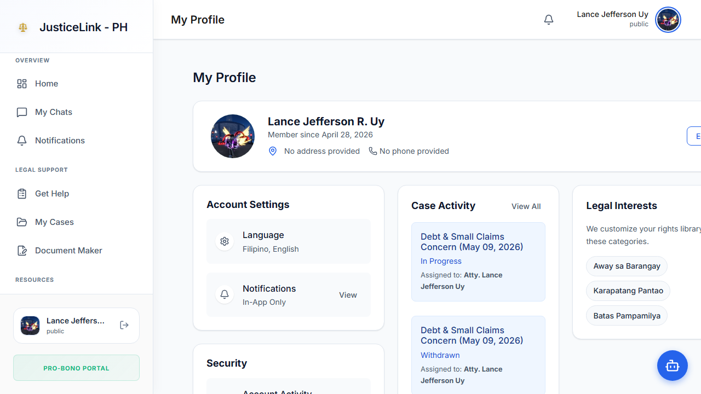

Manage your account information:

- **Personal details** — update your name, address, and contact information.
- **Verification status** — see your Didit identity verification badge.
- **Password** — change your account password.
- **Documents** — view previously generated legal documents.

---

## Attorney Portal

The Attorney Portal is for verified volunteer attorneys. After logging in, you land at `/legal/dashboard`.

---

### Attorney Dashboard

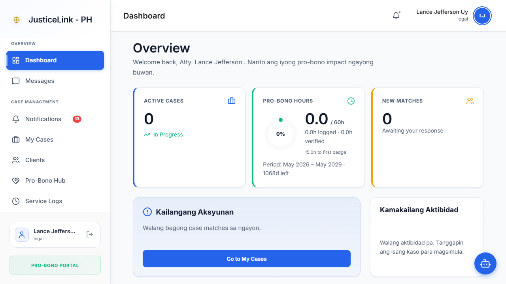

The dashboard provides an overview of your legal aid activity:
- **Open cases** — count of active cases assigned to you.
- **Pro-bono hours logged** — progress toward the 60-hour/3-year IBP target.
- **Recent activity** — latest case updates and client messages.
- **Case status breakdown** — visual summary of cases by status.

---

### My Cases

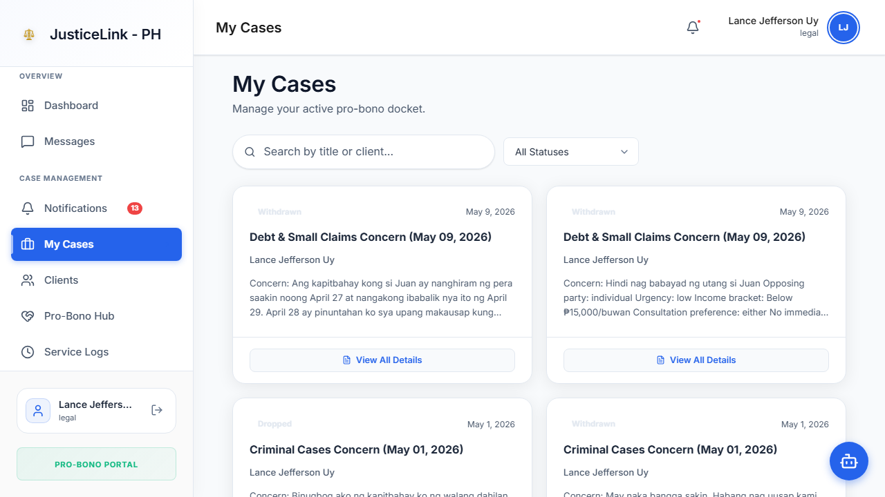

View and manage all your assigned cases:

1. Navigate to **My Cases** in the sidebar.
2. The table shows each case with client name, issue type, current status, and date filed.
3. Click a case to open the detail view where you can:
   - Update the case status (Pending Triage → In Progress → Hearing Scheduled → Closed)
   - Add case notes
   - Attach documents
   - Message the client

**Case Statuses:**

| Status | Meaning |
|--------|---------|
| Pending Triage | Awaiting attorney review |
| In Progress | Attorney is actively working the case |
| Hearing Scheduled | A court or barangay hearing is set |
| Demand Sent | A formal demand letter has been sent |
| Closed - Won | Case resolved favorably |
| Closed - Lost | Case closed without the desired outcome |

---

### Clients

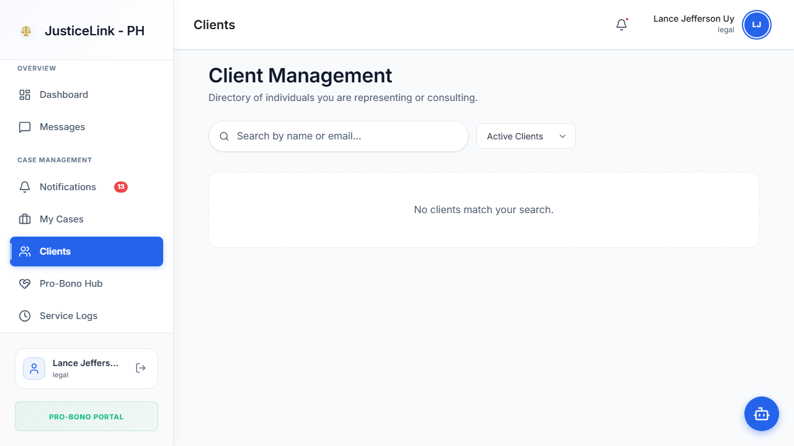

A directory of all clients assigned to you:
- Search by name, email, or case type.
- Click a client to view their profile, filed cases, and contact details.

---

### Case History

Review all closed and resolved cases you have handled:
- Filter by date range, case type, or outcome.
- Use this for record-keeping, reporting, and IBP compliance documentation.

---

### Pro-Bono Hub

Track your pro-bono service toward the IBP 60-hour requirement (per 3-year period):

- **Hours logged** — cumulative pro-bono hours across all cases.
- **Hours remaining** — how many more hours are needed for the current period.
- **Progress bar** — visual indicator of completion percentage.
- The hub auto-calculates hours from your service log entries linked to closed cases.

> The IBP Code of Professional Responsibility requires volunteer attorneys to render at least 60 hours of free legal aid per 3-year period.

---

### Service Logs

Log the time you spend on each case for pro-bono compliance:

1. Navigate to **Service Logs** in the sidebar.
2. Click **Add Log Entry**.
3. Select the case, date, hours spent, and description of service rendered.
4. Save the entry. It automatically contributes to your Pro-Bono Hub total.
5. Previous log entries can be edited or deleted.

---

### Attorney Messages

Communicate with all your clients through a unified inbox:
- All case-linked message threads appear in the left panel.
- Select a thread to view the conversation history.
- Send messages, share documents, or ask for additional information.

---

### Attorney Profile

Manage your professional credentials and account:
- **Personal details** — name, address, contact info.
- **Professional credentials** — IBP number, bar roll number, areas of practice.
- **Verification status** — shows whether your credentials have been approved by an admin.
- **Password** — update your account password.

---

## Admin Portal

The Admin Portal is for Super Administrators managing the entire platform. After logging in, you land at `/admin/dashboard`.

---

### Admin Dashboard

A high-level overview of platform health:
- **Total users** — registered citizens, attorneys, and admins.
- **Active cases** — open cases across the platform.
- **Pending verifications** — attorney accounts awaiting review.
- **Recent activity** — latest audit log entries.
- **System status** — backend health indicators.

---

### Account Management

Full CRUD control over all user accounts:

1. Navigate to **Accounts** in the sidebar.
2. Search or filter by role, status, or registration date.
3. Actions per user:
   - **View** — see full profile and case history.
   - **Edit** — update role, verification status, or contact info.
   - **Deactivate** — suspend an account without deleting data.
   - **Delete** — permanently remove an account (use with caution).
4. Use **Create Account** to manually add an admin or staff account.

---

### Attorney Verifications

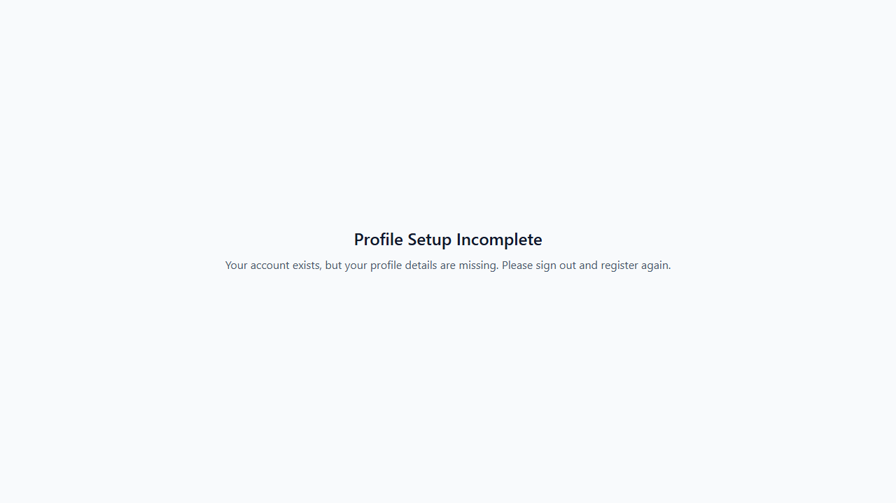

Review and approve or reject attorney registration requests:

1. Navigate to **Attorney Verifications** in the sidebar.
2. Pending applications are listed with the attorney's name, IBP number, and submitted documents.
3. Click **Review** to open the detail view:
   - View the uploaded IBP card photo and selfie.
   - Check the IBP number against official records.
   - Verify bar roll number.
4. Click **Approve** to activate the account, or **Reject** with a reason.
5. The attorney receives an email notification of the decision.

---

### Audit Logs

An immutable record of all significant system events:
- User logins and logouts
- Account creation, edits, and deletions
- Case status changes
- Document generation events
- Admin actions

Filter logs by date range, event type, or user. Use the export function to download logs as CSV for compliance reporting.

---

### System Settings

Configure platform-wide behavior:

| Setting | Description |
|---------|-------------|
| **Maintenance Mode** | Temporarily take the platform offline for all users |
| **Registration** | Enable or disable new citizen/attorney registrations |
| **Feature Flags** | Toggle individual features (document generator, Kampi chatbot, etc.) |
| **Backup & Restore** | Export a full database backup or restore from a previous backup |
| **Email Notifications** | Configure which system events trigger email alerts |

> Changes to system settings take effect immediately. Enable maintenance mode before performing database operations.

---

*For technical documentation, setup instructions, and API reference, see [README.md](README.md).*
