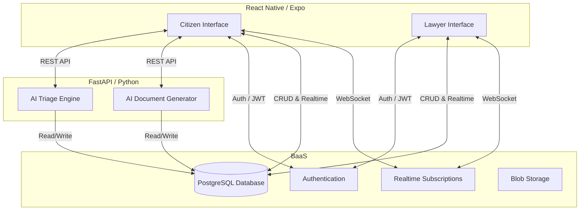
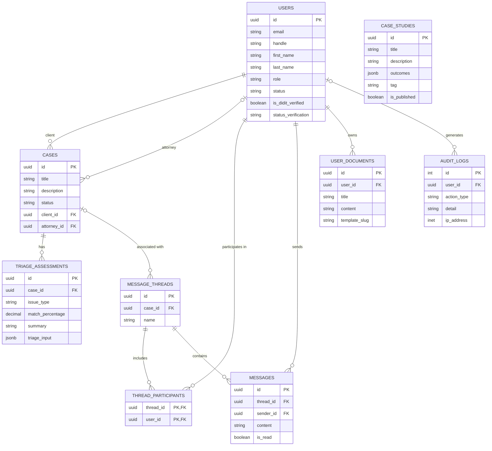

# JusticeLink Mobile App - Project Documentation

## 1. Project Title and Description

**Project Title:** JusticeLink (Mobile App Name: Laya)

**Description:**
JusticeLink is a modern legal tech platform designed to bridge the gap between the public and legal professionals in the Philippines. The core of the platform is a cross-platform mobile application built with React Native (Expo) that empowers citizens with accessible legal tools and provides volunteer attorneys with an efficient platform to manage pro bono cases.

## 2. Project Objectives Defined

The primary objectives of the JusticeLink mobile application are:
* **Democratize Legal Access:** Provide an accessible entry point for citizens to understand their legal situations and seek appropriate help.
* **AI-Assisted Legal Triage:** Utilize AI to evaluate user situations, suggest immediate next steps, and categorize cases accurately.
* **Automated Document Drafting:** Streamline the creation of standard legal documents (e.g., Barangay Complaints) through an interactive, conversational AI interface.
* **Efficient Lawyer Matching and Management:** Provide a dashboard for legal professionals to discover cases, review AI triage summaries, and manage their active engagements.
* **Secure and Seamless Communication:** Facilitate real-time, secure messaging between citizens and their assigned legal professionals.

## 3. Scope and Limitations Identified

### Scope
* **Cross-Platform Mobile App:** Built using React Native (Expo) targeting both Android and iOS devices.
* **Dual User Personas:** Separate, tailored experiences for Public End-Users (Citizens) and Legal Professionals (Volunteer Attorneys).
* **AI Integration:** Conversational interfaces for legal triage and document generation, powered by a Python (FastAPI) backend.
* **Real-time Infrastructure:** Chat and notification systems leveraging Supabase Realtime subscriptions.
* **Identity Verification:** Integration of identity verification mechanisms (OCR, manual verification) for users and legal professionals.

### Limitations
* **Geographical Focus:** The current iteration is specifically tailored to the Philippine legal system (e.g., handling Barangay Complaints, requiring IBP/Roll numbers for lawyers).
* **AI Boundaries:** The AI acts as an assistant and drafting tool, not a replacement for certified legal counsel. Final review by a legal professional is still required.
* **Connectivity:** The app relies heavily on real-time database connections and AI API calls, necessitating a stable internet connection.
* **Offline Capabilities:** Limited functionality when the user is disconnected from the network.

## 4. Updated System Flowchart / Architecture Diagram

The system follows a modern decoupled architecture, utilizing a mobile frontend, an AI-focused backend, and a Backend-as-a-Service (BaaS) for core data and authentication.

## 5. Database Design (ERD)

The database is built on PostgreSQL (hosted via Supabase). Below is an Entity-Relationship Diagram highlighting the core tables and their relationships.

## 6. Project Progress Report (Current Accomplishments)

The mobile application is undergoing rapid development. Here is the current state of the implemented features:

### 🚀 Core Features & UI
* **Authentication Flow:** Complete login and registration screens successfully connected to Supabase Auth.
* **Role-Based Routing:** Seamless and secure navigation logic established for different user types (Public End-Users vs. Legal Professionals).
* **Modern Design System:** Implemented a clean, gap-free, and responsive UI heavily utilizing Tailwind-inspired utility styling and React Native flexbox principles.

### 🤖 AI-Powered Tools
* **Interactive AI Document Drafter:**
  * Created a conversational chat interface (`DocumentGeneratorScreen`) where users explain their legal situation.
  * Implemented an active AI backend that dynamically gathers missing information through follow-up questions.
  * System successfully generates fully formatted legal documents (e.g., Barangay Complaints) once sufficient data is collected.
  * **Recent Milestone:** Fully optimized Android keyboard behavior, implementing custom offset tracking for gap-free and clip-free chat interactions.
* **AI Triage System:** Initialized the conversational interface (`TriageScreen`) for evaluating user situations and suggesting immediate legal next steps.

### ⚖️ Legal Professional Dashboard
* **Case Management:** Built the UI (`LegalCasesScreen`, `LegalCaseDetailsScreen`) for lawyers to view available cases, active engagements, and detailed case information.
* **Dashboard Overview:** Created the `LegalDashboardScreen` to provide at-a-glance statistics and recent activities for the logged-in professional.

### 💬 Communication
* **Messaging System:** Implemented a real-time chat interface (`ChatThreadScreen`) connecting end-users and assigned legal professionals, equipped with the same highly-optimized Android keyboard avoidance architecture used in the AI Drafter.

### 🔄 Next Steps / Active Development
* Refining the prompt logic for specific document generation (e.g., ensuring Barangay Complaints address the barangay generically rather than specific placeholders).
* Finalizing the connection between the AI Triage system and the lawyer-matching database flow.
* Enhancing real-time WebSocket subscriptions for the messaging system to ensure robust delivery.
